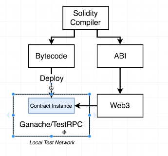
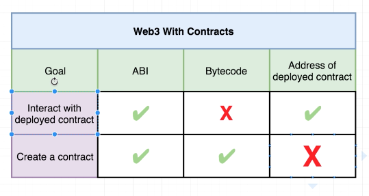

- [Solidity Compiler](#solidity-compiler)
  - [Imports](#imports)
- [Web3 + problems](#web3--problems)
- [Deploy Scripts](#deploy-scripts)
- [Ganache](#ganache)

## Solidity Compiler



Recently, Solidity released `version 0.5.0` and introduced many breaking changes. When running your test code you are probably getting or will probably get the following:

AssertionError `[ERR_ASSERTION]`: Invalid callback specified

1. Uninstall solc:

- `npm uninstall solc`

2. Reinstall one of two versions:

- The version used in the course:

  - `npm install --save solc@0.4.17`

    or

- The newest version that will not break:
  - `npm install --save solc@0.4.25`

Remember to do this for each solc installation

### Imports

We can't import content like we would with node projects. Require attempts to run the imported file, but we're not using javascript - We're using .sol files.

_Path_ gives us cross platform compatibility.

```js
const path = require("path");
const fs = require("fs");
const solc = require("solc");

const inboxPath = path.resolve(__dirname, "contracts", "Inbox.sol");
const source = fs.readFileSync(inboxPath, "utf8");

module.exports = solc.compile(source, 1).contracts[":Inbox"]; // 1 = number of contracts?
// We're now exporting all compiled contracts
// We then index into the contracts element with the key :Inbox
```

This gives us a path from the HD all the way to the CWD, then we add on the additional folder children.

## Web3 + problems

An async operation.
Web3 gives us a way to deploy contracts to the web, it also allows us to interact with contracts that exist on the web.



There are two groups in the wild right now. V1 allows for promises and async.

But most content online are using the 'primitive' version. Very different problems. Only worked with callbacks and that's messy.

## Deploy Scripts

We're going to be using real money to send these to the network so tests are more important than ever.

## Ganache

_Used to be called TestRPC, now called Ganache_
