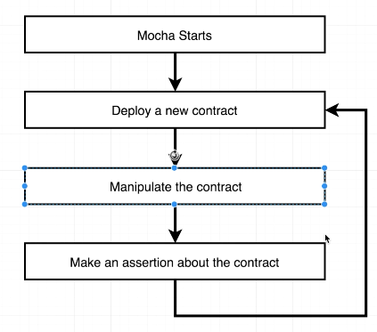
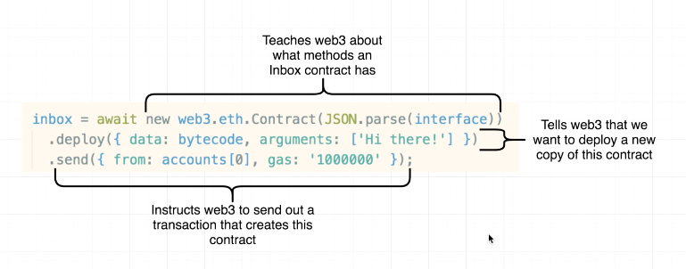
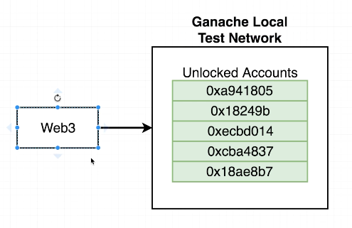

## Custom Mocha Tests

- it = Run a test and make 1 assertion
- describe = Groups together 'it' functions
- beforeEach = Execute some general setup code.

It's really important to test contracts as they're working with real money.

## Mocha

Inside the package.json we need to add the test script to use for running tests.

```json
  "scripts": {
    "test": "mocha"
  }
```

So we fill out the assert equals with the function that's being called followed by what the test should return. ie: car.park should be equal to 'stopped'

```js
class Car {
  park() {
    return "stopped";
  }

  drive() {
    return "vroom";
  }
}

let car;
// gives describe functions access to this variable

beforeEach(() => {
  car = new Car();
});

describe("car class", () => {
  it("can park", () => {
    assert.strictEqual(car.park(), "stopped");
  });

  it("can drive", () => {
    assert.strictEqual(car.drive(), "vroom");
  });
});
```

`npm run test`

## Fetching Accounts Ganache



Most of the functions in the Web3 package return promises. Instead of using .then on all of these functions we use async await.

Code below returns 10 unlocked test accounts from the Ganache lib

```js
let accounts;

beforeEach(async () => {
  // Get a list of accounts
  // Web3 is almost always a promise
  accounts = await web3.eth.getAccounts();
});

describe("Inbox", () => {
  it("deploys a contract", () => {
    console.log(accounts);
  });
});
```
