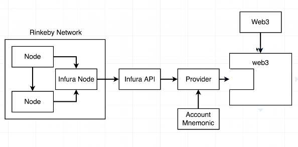

The Infura API gives us access to a node in order for web3 to access Rinkeby network.

This removes the need for us to host a complete node on our local dev env, which apparently is a pain.

https://infura.io/dashboard/ethereum/cb456769fcae4577a92bb261ff6f3cc7/settings

Change endpoint to Rinkeby from the Infura Dasboard of the new project.
