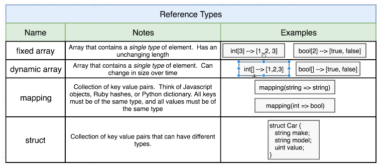
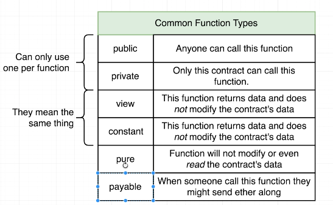
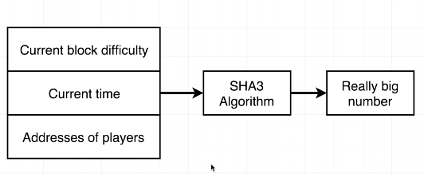

Variable types


Integer Ranges


## Global Variable

The `msg` is a global variable that is available for the entirity of the contract and all it's methods. We can get the address of anyone making or changing the contract from here


## Reference Types



### Array behaviour

**Fixed and dynamic available**

When calling an Array, we don't get the whole variable back, instead we're asked to provide an index for the array item that we're requesting.

To get all the numbers in an array, we need to write a function that does just that, returns the final array. The self generated getter, doesn't do this by default.

By default `strings` are saved as arrays of strings. **"YET"**, could be different.

### Mapping & Structs

Mappings and structs look just like javascript objects, but with mapping, the keys have to be the same and the values have to be the same (type). Structs can have mixed types.

Mapping for many things, Struct for single type of thing with varied values.

### Function Types



### Sudo Random Numbers

**Gaming the contract**

We don't have the ability to create a random number, so we have to fake it. This means that the contract can be gamed...



All of these things can be known ahead of time so someone can game the contract, there shouldn't be any element of randomness within the contract in order to avoid this.

We create a random function, then create a function called pick winner.

- random() takes a few numbers and mashes them together to generate a hash (super long number)

- pickWinner() creates a uint called index based on random()'s return value and % the number of players in the player array - This gives us a remainder that will always match the number of players in the array. SUDO RANDOM.

- Taking that index variable and indexing into players array we then transfer that balance from the class instance to the player.

- RESET players = new address[](0) after sending the money will reset the array that's tracking players, so now we have no money and no players.

### Sudo Admin access to functions

We know that we can exit a function using require if a condition is not met. So we can also do this if someone tries to trigger the payment function and they're not the manager.

### Function Modifiers

Used to implement the DRY principle on functions. The name of the function can be anything you want.

Madness, this takes all of the code from inside the function ie: `function paySomeone() public restricted {}` and places it where the underscore is. It's kind of like a before each set up from mocha tests.

```js
modifier restricted() {
    require(msg.sender == manager);
    _;
}
```
