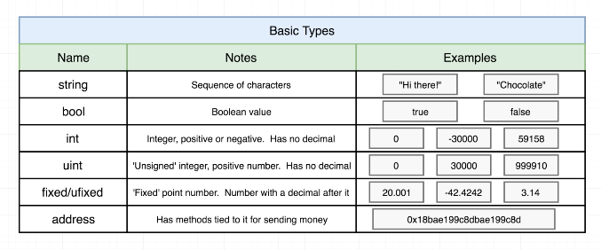
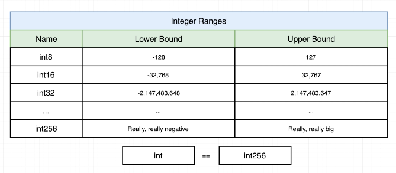
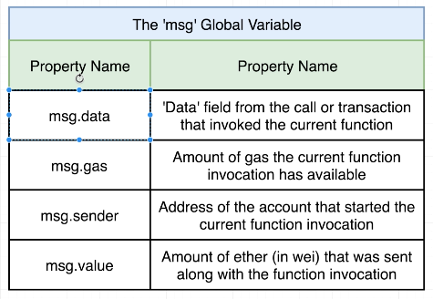

Variable types

Integer Ranges

## Global Variable

The `msg` is a global variable that is available for the entirity of the contract and all it's methods. We can get the address of anyone making or changing the contract from here

