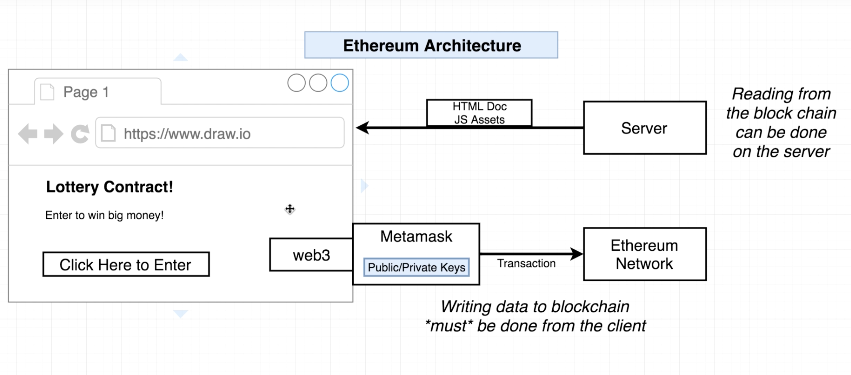
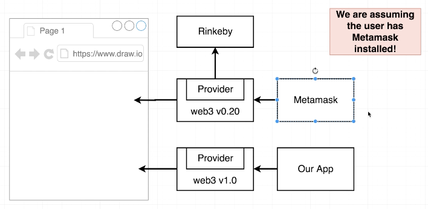

### React

The server is pretty much taken out of the equation here. React interacts with the web3 env. The private keys never get sent to the server. They live with the client and go straight to the web3 service.

React is the best way to interact with the web3 service. Vanilla JS is too dificult.



#### Set up:

`npx create-react-app my-app`

#### Web3 Gotchas

- Apparently metamask has removed the web3 inject? Will this be a problem?



#### For Basic Apps

**Metamask** automatically **injects web3** into all pages that you're running in browser - or it used to...

The provider within this, points to Rinkeby test network.

We have to force point the web3 version that we're using through our app.

We're trying to hijack the version from Metamask and replace it with our chosen version.

In react src we create a web3 config file `web3.js`

**Updates**

- ADDITION This is needed to allow this application to interact with metamask `window.ethereum.enable();`

```js
import Web3 from "web3";

window.ethereum.enable();

const currentProvider = window.web3.currentProvider;
const web3 = new Web3(currentProvider);

console.log("prov is - ", currentProvider);
export default web3;
```

---

### How it works so far

The compile script took out .sol code and generated an ABI/interface + Bytecode (BC is used to deploy our contract to the network)

The ABI is the transition from block to JS.

The ABI gets fed into the Web3 instance which creates a local copy of the contract with all of the function info, it's then deployed with an address...

### Deployment

Using the compile.js and deploy.js we're need to grab some info.

**--Inside old project--**
`|- deploy.js`

```js
console.log(interface);
console.log(results.options.address);
```

`node deploy.js`

**--Inside React--**
We create a file eg: `ContractName.js`, import web3 and copy over ABI and Address

Currently making a local copy/object of the contract that is on the blockchain

`|- lottery.js`

```js
export default new web3.eth.Contract(abi, address);
```
