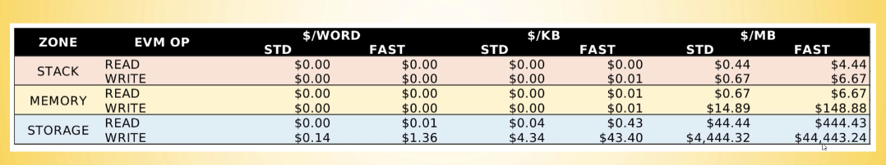
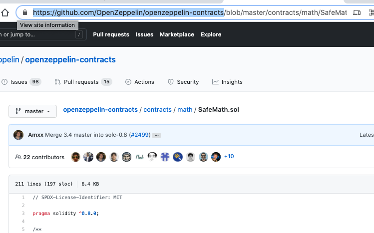
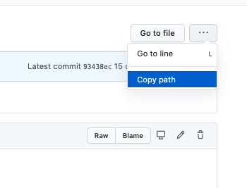

- [Never](#never)
- [Checks effects interaction pattern](#checks-effects-interaction-pattern)
- [Variables](#variables)
- [Wrap Around](#wrap-around)
- [Memory / Storage](#memory--storage)
- [Fixed Points](#fixed-points)
- [Strings](#strings)
- [Balance syntax update](#balance-syntax-update)
- [Start Stop Pause](#start-stop-pause)
- [Sending Partial amounts](#sending-partial-amounts)
- [Errors +Atomic](#errors-atomic)
- [FallBack Functions](#fallback-functions)
- [View + Pure / Writing / Constant (deprecated)](#view--pure--writing--constant-deprecated)
- [Setters and Getters](#setters-and-getters)
- [Visibility.](#visibility)
- [Inheritance, Modifiers, Importing](#inheritance-modifiers-importing)
- [Return Values - Event / Emit](#return-values---event--emit)
- [ABI](#abi)
- [Function hashes](#function-hashes)
- [Libraries + For](#libraries--for)

## Never

Try to assert that the total of recieved payments matches the amount of the balance attached to the contract....

## Checks effects interaction pattern

Look this up for security situations. Apparently to do with the re-entry.

- Check if you can do something
- Produce the effect
- Interaction with outside addresses etc is last.

## Variables

All variables are initialised as their default, so false, "", 0.

There is no undefined or null in solidity

## Wrap Around

Numbers that go past -0 become another long number. This an automatic wrap around.

## Memory / Storage

Memory is typically cheaper than storage in terms of wei.

## Fixed Points

These are not supported apparently. If you need decimals in the contract.

## Strings

Are treated as arrays of data, you can't index into a specific character in a string.

Strings are also expensive to save and there are no real built in methods that work with them in solidity.

## Balance syntax update

```js

function getBalance() public view returns(uint) {
    return address(this).balance
}

```

```js

uint public balanceReceived;

function receiveMoney() public payable {
    balanceReceived += msg.value
}

```

```js

function withdrawMoney() public {
    address payable to = msg.sender

    to.transfer(this.getBalance())
}

```

## Start Stop Pause

**Setting th owner of a contract**
set the owner in the constructor function.

```js

address owner;

constructor() public {
    owner = msg.sender;
}

require(msg.sender == owner, "error messages here")
```

**Pausing**

```js
bool public paused; //false by default

function setPaused(bool _paused) public {
    require(msg.sender == owner, "you are not owner")
    pause = _paused
}

function withdrawMoney() public {
    require(msg.sender == owner, "you are not owner")
    require(!paused "contract is paused")
    to.transfer(this.getBalance())
}
```

**Destroying a smart contract**
They can't be completly removed from a block.

Calling an internal function called self destruct. It gets one argument which is an address that receives all the remaining funds upon destruction.

```js

function destroySmartContract(address payable _to) public {
    require(msg.sender == owner, "you are not owner")
    selfdestruct(_to)
}

```

## Sending Partial amounts

```js

function withdrawPartialFunds(address payable _to, uint _amount) public {
    require(balanceReceived[msg.sender] >= _amount, "not enough funds");
    balanceReceived[msg.sender] -= _amount;
    _to.transer(_amount);
}

```

## Errors +Atomic

When errors occur (even after a state change), everything is reverted back to it's original state. You can NOT catch errors in Solidity contracts.

**Revert op (0xfd) for Require**
When the error occurs, the remaining gas is returned to the user.

**Invalid op (0xfe) for Assert**
This consumes the gas. Assert should only really be triggered if something crazy happens otherwise shouldn't come into play.

## FallBack Functions

No name, if you blindly send ether without using a function, it gets sent here.

External only.

If you don't have a function to receive money or something is wrong, the data will get dealt with by the fallback

```js

function () external payable {
    receiveMoney()
}

```

## View + Pure / Writing / Constant (deprecated)

View returns something, looks like it simply reads the state.

Pure does not interact with any storage variables. It can mess with scoped variables, like params etc but not storage vars.

View can access the state BUT only in read only. They can call other view and pure but can not interact with writing functions.

Pure functions can call another pure function but not others that mess with state / view / writing / storage.

Writing can call both of the above and interact with state

## Setters and Getters

**Writing** = Transaction
**Reading** = Call

Calls are effectively free, there is a mechanism for gas, but you'd pay it back to yourself, so .... free.

## Visibility.

Public - internal and external.
Private - you can not reach a private function from outside, nor parents.
External - only call from other smart Cons,
Internal - like private, but also from derived contracts.

## Inheritance, Modifiers, Importing

**Modifier**

```js

modifier onlyOwner() {
    _;
}

function doSomething() public onlyOwner {
    "all of this content gets placed into the modifier function on compile."
}

```

**Inherited**

```js

contract Owned {
    address owner

    constructor() {
        owner = msg.sender
    }

    modifier onlyOwner() {
        require(msg.sender == owner, "you are not allowed");
    }
}

contract Number1 is Owned {
    "inherits all of the modifiers of the parent."
    "We can use modifiers here as they're inherited"
}


```

**Importing**

Placing files in the same directory allows importing. Similar to react allowing us to use the functions that are declared in the imported file in the new file. Not sure how well that would work in VSCode.

During deployment, it seems to import everything and deploy it so you don't have to deploy individually.

`import "./Owned.sol"`

## Return Values - Event / Emit

Storing data on the chain is very expensive per MB



- Return Values
- Trigger functionality (like webhooks listening for events)
- Cheap data storage
  - They can be emitted, but can't be used in Solidity.

Basically used to inform users that something happened on the blockchain.

Apparently you can't get return values from the person that started the transaction when you're deployed to a real network. You have to use...

**Events + Logs (up to 3)**
You have to set up an `Event` function with arguements. Then inside the function before you return anything you have to `emit` information that you want to be shown externally.

In the args part of the response we can see the variables that were set in the params of the event section.

```js

event TokenSent(address _from, address _to, uint _amount) {
    // params are values that we want to transmit externally.

}

function doSomethingElse() {
    emit TokenSent(msg.sender, _to, _amount);
}

```

## ABI

Basically a JSON file that describes all of the functions of the smart contract.

## Function hashes

## Libraries + For

SafeMath for example protects from wraparounds and throws errors on your behalf when things go wrong using their functions.

**Importing libraries from Github**

Copy partial part of the url



Copy the path from the button



`https://github.com/OpenZeppelin/openzeppelin-contracts/contracts/math/SafeMath.sol`

This imports the file to remix.

Then instead of import keywords

`using SafeMath for uint`
using contract Name for variable type
